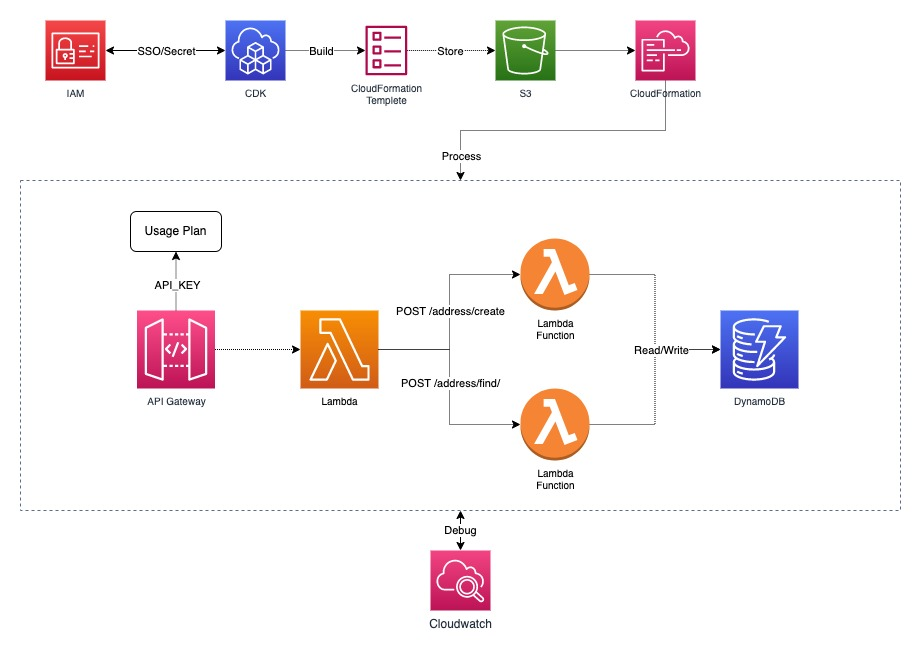

# Transurban-coding-exercise

## Deploying the CDK stack

### Prerequisites

Notes: The following steps assume you already have AWS CDK CLI installed and configured with your AWS account.

Please refer to the following link for more
information:https://docs.aws.amazon.com/cdk/v2/guide/getting_started.html#getting_started_configure

In case your AWS CDK CLI is not initialized, you can run the following command to initialize the CDK project:

```bash
aws configure sso 
aws sso login  
```

### Getting Started

**Please continue the following process after completing prerequisites**

1. Install the dependencies
   ```bash
   npm install
   ```

2. Create a S3 bucket to store the CDK assets, `ACCOUNT-NUMBER` and `REGION` are your AWS account number and the region
   where you want to deploy the CDK stack.
   ```bash
   cdk bootstrap aws://ACCOUNT-NUMBER/REGION
   ```

3. Deploy the CDK stack
   ```bash
   cdk deploy
   ```

4. Find the output of the API Gateway URL and API Key in the terminal output after the deployment is completed.
   ```
   TransurbanCodingExerciseStack.APIKeyID = XXXX
   TransurbanCodingExerciseStack.RestAPIEndpointB14C3C54 = https://XXXX.amazonaws.com/prod/
   ```

5. Retrieve the API Key value from api gateway, `XXXX` is the `APIKeyID` from the output of the CDK deployment.
    ```bash
    aws apigateway get-api-key --api-key XXXX --include-value
    ```

## Infrastructure Diagram


## API Documentation
### Endpoints

| Method | URL               | Description                                                               |
|--------|-------------------|---------------------------------------------------------------------------|
| `POST` | `/address/find`   | Find address using user ID, and an optional filter of Suburb and Postcode |
| `POST` | `/address/create` | Create address under a specific user                                      |

Detail: https://documenter.getpostman.com/view/30661295/2sAXqs7NAg

### Response Status Code

| Code  | Title                   | Description                                                                            |
|-------|-------------------------|----------------------------------------------------------------------------------------|
| `200` | `OK`                    | When a request was successfully processed                                              |
| `201` | `Created`               | Every time a record has been added to the database                                     |
| `400` | `Bad request`           | When the request could not be understood (e.g. invalid syntax).                        |
| `401` | `Unauthorized`          | When authentication failed. (no key/key invalid)                                       |
| `403` | `Forbidden`             | When an authenticated user is trying to perform an action does not have permission to. |
| `404` | `Not found`             | When URL or entity is not found.                                                       |
| `500` | `Internal server error` | When an internal error has happened                                                    |

Notes: Inspired by https://github.com/ml-archive/readme/blob/master/Documentation/how-to-write-apis.md?plain=1

## QA

### Type of Testing

- `type-coverage` is used to check the type coverage of the project.
- `npm run unit-test` is used to run the unit tests & infrastructure tests.
- `npm run integ-test` is used to run the integration tests.

### Test Approaches:

- **Infrastructure testing**: Test the CDK template using aws-cdk assertions to ensure the generated CloudFormation
  template is correct.
- **Unit testing**: Test the business logic of the Lambda functions (find handler/create handler). The test are
  conducted by `aws-sdk-client-mock` and `jest`. It is more focusing on the return status code/body and the command
  send to DynamoDB.
- **Integration testing**: Test the work flow of creating and finding address. The test are conducted
  by `integ-tests-alpha`. We built a real AWS infrastructure and test the interaction between Lambda and DynamoDB.
  This resources will be destroyed after the test.

## Can be improved?

### Infrastructure Design
- **API Gateway**: The API Gateway is open to the public, it is better to add a custom domain and enable the WAF to
  protect the API.
- **CloudWatch**: It will be nice to setup and configure the CloudWatch to monitor the API Gateway and Lambda functions.
  Also to send SMS/Email using SNS/SES when the error rate is high to ensure the system is healthy.

### Testing

- **Integration testing**: There are several drawback of current integration testing:
    - The test is using real AWS resources, it will be costly when the test cases are increased, also it not efficiency
      compare to local testing environment. 
    - The integration testing library is not stable as it is currently in alpha version. It is better to use the stable
      version of the library to ensure the test is reliable. (e.g. `assertAtPath` is not working as expected)
    - I have bypass the access control when conducting the integration testing, it is better to implement the access
      control by `secret manager` or `VPC` to ensure the security of the system while doing testing.
- **Testing approaches**:
    - The integration testing is not fully automated, it is better to have a CI/CD pipeline to run the integration test
      automatically when the code is pushed to the repository.
    - Seeking an alternative way to test the integrating between Lambda and DynamoDB is necssary, as the current
      integration testing library is not stable.
      - I will highly recommend to implement the local testing environment using `localstack` or `dynamodb-local` in the early stage of testing. Then move the deployment testing on the real
        AWS resources at later stage (staging).
      - Implemented other testing approaches such as `E2E testing` to test the whole system from the user perspective.

## Assumptions

- The API key is created when deploying the CDK stack, a formal way of doing it in production environment is to
  automatically generate it when user try to login with their credential.
- The find address API `POST /address/find`, params "suburb" and "state" are optional, the expression is OR between
  suburb and state.